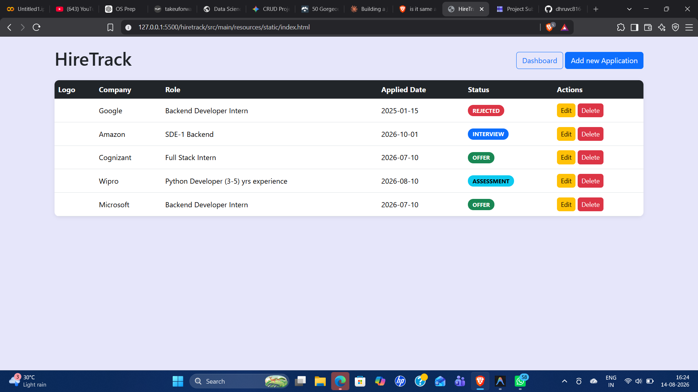

# corizo-webdev-hiretrack
HireTrack — Job &amp; Internship Application Tracker built by Dhruv Chaudhary as part of the Web Development internship at Corizo Edutech. A Web Developement  application to track job applications with REST APIs, MySQL, and a dynamic Bootstrap + JS frontend.

# HireTrack — Job & Internship Application Tracker

## Internship Submission

**Internship Organization:** Corizo Edutech
**Project Title:** HireTrack — Job & Internship Application Tracker
**Submitted By:** Dhruv Chaudhary
**Duration:** 11/08/2026- 14/08/2026
**Domain:**Web Development

---

## Objective

The objective of this project is to design and develop a full-stack web application that helps users track their job and internship applications end-to-end — from applying to receiving an offer or rejection — while gaining hands-on experience in Java backend development using Spring Boot, REST API design, and database integration with MySQL.

## Project Description

HireTrack is a Job & Internship Application Tracker that allows users to record, update, and monitor the status of their job applications in one place. It replaces manual tracking (spreadsheets, notes) with a structured system offering CRUD operations, status-based filtering, and a visual analytics dashboard.

## Tech Stack

**Backend**
- Java 21
- Spring Boot 3.3.x
- Spring Data JPA + Hibernate
- MySQL 8.0
- REST APIs

**Frontend**
- HTML5
- Bootstrap 5
- Vanilla JavaScript

**Libraries/APIs**
- Chart.js — dashboard analytics (pie chart)
- AOS (Animate On Scroll) — UI animations
- Clearbit Logo API — dynamic company logo fetching

## Features Implemented

1. **CRUD Operations** — Add, view, edit, and delete job applications
2. **Status Tracking** — PENDING, ASSESSMENT, INTERVIEW, OFFER, REJECTED
3. **Dynamic Company Logos** — fetched live via Clearbit API based on company domain (no hardcoded images)
4. **Analytics Dashboard** — total applications, status-wise counts, and pie chart visualization
5. **Backend Validation** — `@NotBlank`/`@NotNull` constraints with meaningful error responses
6. **Global Exception Handling** — centralized handling using `@RestControllerAdvice` for 404 and 400 errors
7. **Responsive UI** — Bootstrap-based responsive design with smooth AOS animations

## Project Architecture

```
hiretrack/
├── src/main/java/com/hiretrack/hiretrack/
│   ├── entity/JobApplication.java
│   ├── enums/ApplicationStatus.java
│   ├── repository/JobApplicationRepository.java
│   ├── service/JobApplicationService.java
│   ├── controller/JobApplicationController.java
│   └── exception/
│       ├── ResourceNotFoundException.java
│       └── GlobalExceptionHandler.java
└── src/main/resources/
    ├── application.properties
    └── static/
        ├── index.html
        ├── form.html
        ├── dashboard.html
        ├── css/style.css
        └── js/
            ├── app.js
            ├── form.js
            └── dashboard.js
```

This follows a standard **layered architecture**: Controller → Service → Repository → Database, ensuring separation of concerns.

## Database Schema

Table: `job_application`

| Column | Type |
|---|---|
| id | BIGINT (Primary Key, Auto Increment) |
| company_name | VARCHAR(100) |
| domain | VARCHAR(150) |
| role | VARCHAR(100) |
| applied_date | DATE |
| status | VARCHAR(20) |
| notes | TEXT |
| created_at | TIMESTAMP |
| updated_at | TIMESTAMP |

## API Endpoints

| Method | Endpoint | Description |
|--------|----------|--------------|
| GET | `/api/jobs/applications` | Get all applications |
| GET | `/api/jobs/applications/{id}` | Get application by ID |
| POST | `/api/jobs/createApplications` | Create new application |
| PUT | `/api/jobs/updateApplications/{id}` | Update application |
| DELETE | `/api/jobs/applications/{id}` | Delete application |
| GET | `/api/jobs/status/{status}` | Filter by status |
| GET | `/api/jobs/dashboard/total` | Get total application count |
| GET | `/api/jobs/dashboard/stats` | Get status-wise counts |

## How to Run

1. Create the database:
```sql
CREATE DATABASE hiretrack_db;
```

2. Configure `src/main/resources/application.properties` with your MySQL credentials.

3. Run the application:
```bash
mvn spring-boot:run
```

4. Open in browser:
```
http://localhost:8080/index.html
```

## Working / Demo

### 1. Applications List Page
Displays all job applications in a table with company logo, role, applied date, and status badge. Users can add, edit, or delete applications from here.



### 2. Add / Edit Application Form
A single form used for both adding a new application and editing an existing one. On edit, the form is pre-filled with the selected application's data.


### 3. Dashboard
Shows total applications, status-wise counts (Interview, Offer, Rejected), and a pie chart visualizing the distribution of application statuses using Chart.js.


### How It Works (Flow)

1. User opens `index.html` — the frontend fetches all applications from `GET /api/jobs/applications` and renders them in a table, with company logos loaded dynamically from the Clearbit Logo API based on the domain.
2. Clicking **Add New Application** opens `form.html`, where the user enters company details. On submit, the data is sent via `POST /api/jobs/createApplications`.
3. Clicking **Edit** on any row opens the same form pre-filled with data (fetched via `GET /api/jobs/applications/{id}`), and on submit sends a `PUT /api/jobs/updateApplications/{id}` request.
4. Clicking **Delete** sends a `DELETE /api/jobs/applications/{id}` request and refreshes the list.
5. The **Dashboard** page calls `GET /api/jobs/dashboard/total` and `GET /api/jobs/dashboard/stats` to display summary cards and render a Chart.js pie chart of status distribution.
6. All backend requests pass through the Controller → Service → Repository layers, with validation and centralized exception handling ensuring proper error responses (400 for invalid data, 404 for missing records).

## Learnings

Through this project, I gained practical experience in:
- Building RESTful APIs using Spring Boot and Spring Data JPA
- Designing a normalized MySQL database schema
- Implementing a layered backend architecture (Entity–Repository–Service–Controller)
- Handling validation and exceptions using `@RestControllerAdvice`
- Connecting a vanilla JS frontend to a Spring Boot backend via `fetch()` API calls
- Integrating third-party APIs (Clearbit) for dynamic content
- Debugging real-world issues such as schema mismatches and CORS

## Conclusion

HireTrack demonstrates the practical application of core Java backend concepts learned during the internship at Corizo Edutech, combining REST API development, database design, and frontend integration into a complete working project suitable for real-world use.
